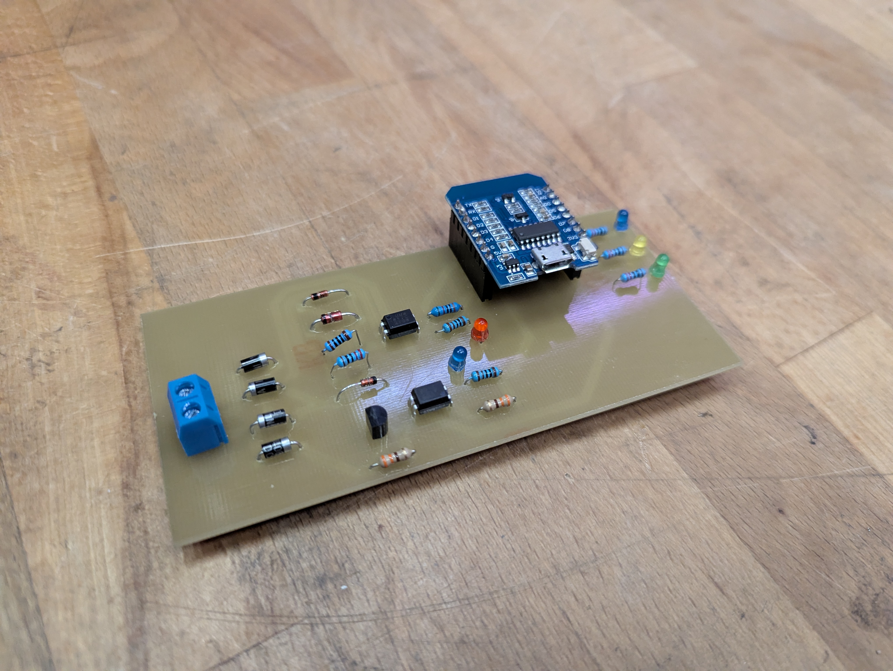
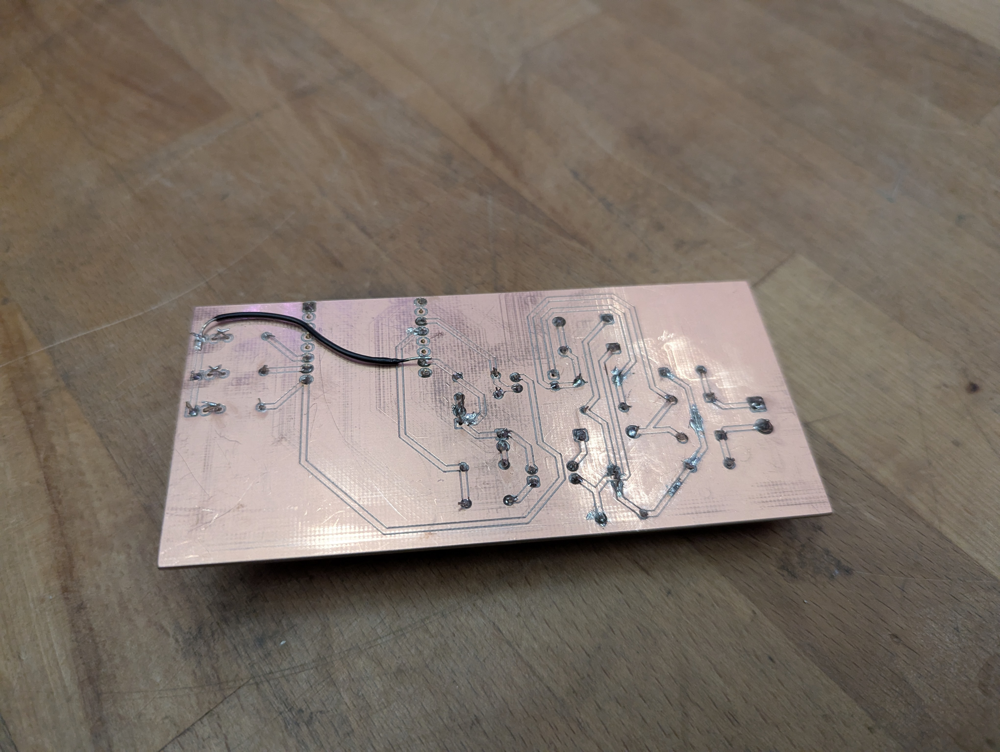
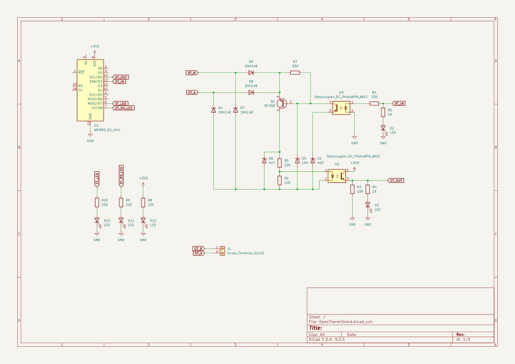
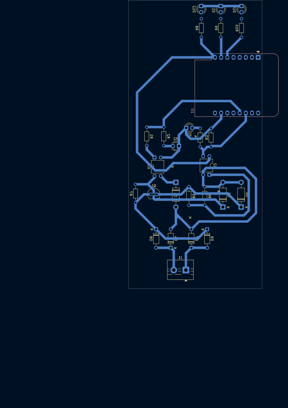
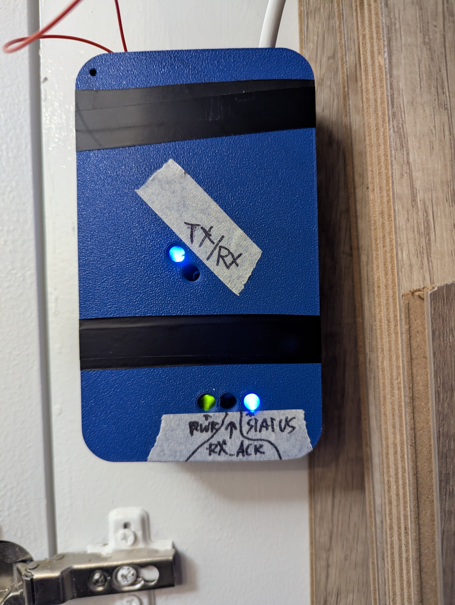

# OpenThermShield
OpenTherm adapter/shield for the wemos d1 mini

The primary goal was low cost, speed and manufacturability. The components were gather in the [Edinburgh Hacklab](https://edinburghhacklab.com/) and milled on the PCB mill in 1 day

My boiler is a Vokera Unica 35C
## Photos

## Schematic
The pinout works if you flash the OTGateway firmware and swap the in/out pins in settings (like in the esphome.yaml), but imo esphome works better so if you're running HA highly recommend that approach

## PCB

## Case

Check out OpenThermShield - Case.3mf (support for bambu-studio). The case was also designed quickly so beware of the cover mount holes being too small. [The USB power supply used](https://www.amazon.co.uk/dp/B0DJVRCLWV)
# esphome.yaml
ESPHome config for the controller
